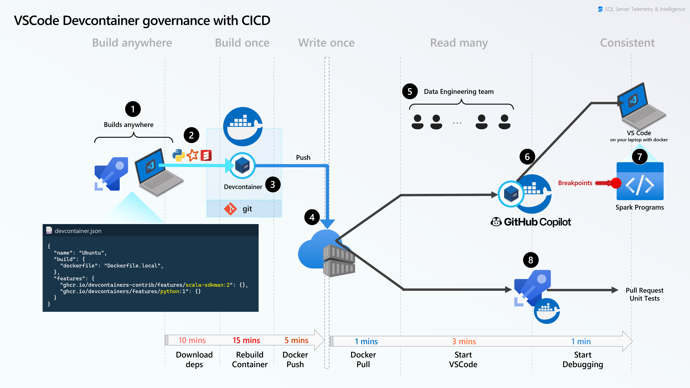

# Devcontainer

## Context

This devcontainer is setup in such a way that we can push the prebuilt devcontainer (with it's features and devcontainer settings) to a Docker Registry. This achieves two goals:

- Developers can spend less time waiting for the devcontainer to build as they can pull the prebuilt image.
- The project can leverage the prebuilt devcontainer image in CI pipelines.

## How does the prebuilt devcontainer work?

1. First, we compute the file hash of all contents of the `.devcontainer` folder. This is used as the tag for the prebuilt devcontainer image. `.devcontainer/devcontainer-hash.txt`

2. We then build the devcontainer image with the computed tag using the `devcontainer` cli tool.
    1. We instruct the `devcontainer` cli tool to use the `devcontainer.local.json` file instead of the default `devcontainer.json`.
    2. The `devcontainer.local.json` file uses the `Dockerfile.local` file to build it's image.

3. We then publish the image
    1. We publish the image to the Docker Registry - in this case - an Azure Container Registry.
    2. After this push happens, we automatically write the new image tag to the `devcontainer.json` file.
    3. Finally, we automatically update the `.github/workflows/templates/container.template.yaml` file to use the new image tag in CI pipelines.

4. Finally, when any engineer opens the devcontainer, the `devcontainer.json` file is used to pull the prebuilt image from the Azure Container Registry.

## Use of the Devcontainer in our Pipelines

The devcontainer is used in our pipelines as our build environment. This means a developer's build environment is exactly the same as the pipeline build environment other than a few caveats:

- Github Pipelines needs to start with the `root` user whilst a developer's devcontainer starts with the non-root `vscode` user.

## References

- [devcontainer Overview](https://code.visualstudio.com/docs/devcontainers/containers)
- [devcontainer CLI docs](https://containers.dev/implementors/reference/)
- [devcontainer image build example](https://github.com/devcontainers/cli/blob/main/example-usage/image-build/build-image.sh)
- [devcontainer metadata reference](https://containers.dev/implementors/json_reference/)